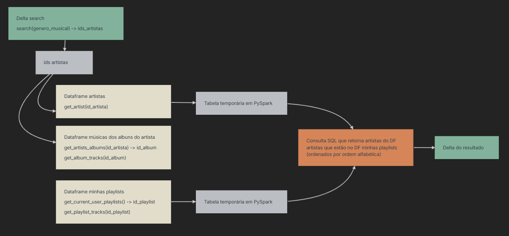

# Desafio Spotify

Este projeto implementa um pipeline de ETL (Extract, Transform, Load) para processar dados da API do Spotify utilizando **Apache Spark**.

## Pré-requisitos  
- Python 3.9 ([Download Python](https://www.python.org/downloads/release/python-390/))
- Java JDK 17 ([Download JDK 17](https://adoptium.net/temurin/releases/))  
- App criado no Spotify ([Dashboard Spotify](https://developer.spotify.com/dashboard/))
- Spark 3.5.6 e Hadoop 3 (
    - [Documentation Spark](https://www.apache.org/dyn/closer.lua/spark/spark-3.5.6/)
    - [Download Spark](https://dlcdn.apache.org/spark/spark-3.5.6/spark-3.5.6-bin-hadoop3.tgz)
    - [Download Winutils](https://github.com/steveloughran/winutils) ou [Download Winutils](https://github.com/cdarlint/winutils)
)
- Delta-spark 3.1.0

## Documentações
- [Apoio para uso de Delta Lake](https://delta.io/latest/delta-spark.html)

## Configuração

### 1. Variáveis de Ambiente  
Crie um arquivo `.env` na raiz do projeto com as seguintes variáveis:
```env
SPOTIFY_CLIENT_ID=your_client_id
SPOTIFY_CLIENT_SECRET=your_client_secret
SPOTIFY_REDIRECT_URI=your_redirect_uri
SPOTIFY_SCOPE=your_scope
AUTH_URL=your_auth_url
TOKEN_URL=your_token_url
```

### 2. Criação do ambiente virtual e instalação das bibliotecas necessárias

```bash
python -m venv venv
.\venv\Scripts\activate
pip install -r requirements.txt
```

### 3. Configuração do Spark, Hadoop e Java

```PowerShell
$env:HADOOP_HOME = "C:\hadoop"
$env:JAVA_HOME = "C:\Program Files\Eclipse Adoptium\jdk-17.0.15.6-hotspot"
$env:SPARK_HOME = "C:\spark-3.5.6-bin-hadoop3"
$env:Path += ";$env:SPARK_HOME\bin;$env:HADOOP_HOME\bin;$env:JAVA_HOME\bin"
```

## Fluxo do Pipeline de Dados



1. **Delta Search**: Busca artistas por gênero musical.  
2. **DataFrames**:  
   - `df_artistas`: Obtém detalhes de cada artista dos gêneros buscados.  
   - `df_musicas`: Coleta músicas de todos os albums dos artistas encontrados.
   - `df_user_playlists`: Obtém detalhes de cada playlist salva pelo usuário.
3. **Tabelas temporárias**:
   - `artistas_view`: Tabela temporária do DataFrame `df_artistas`.
   - `user_playlists_view`: Tabela temporária do DataFrame `df_user_playlists`.
4. **Consulta SQL**: Filtra artistas presentes nas playlists do usuário.  
5. **Saída**: Salva em Delta. 